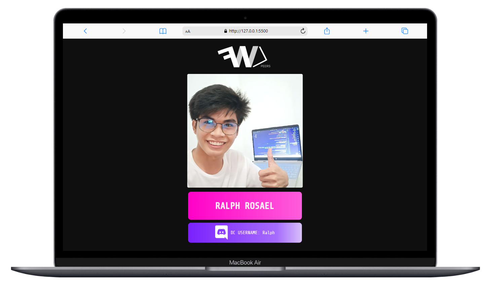
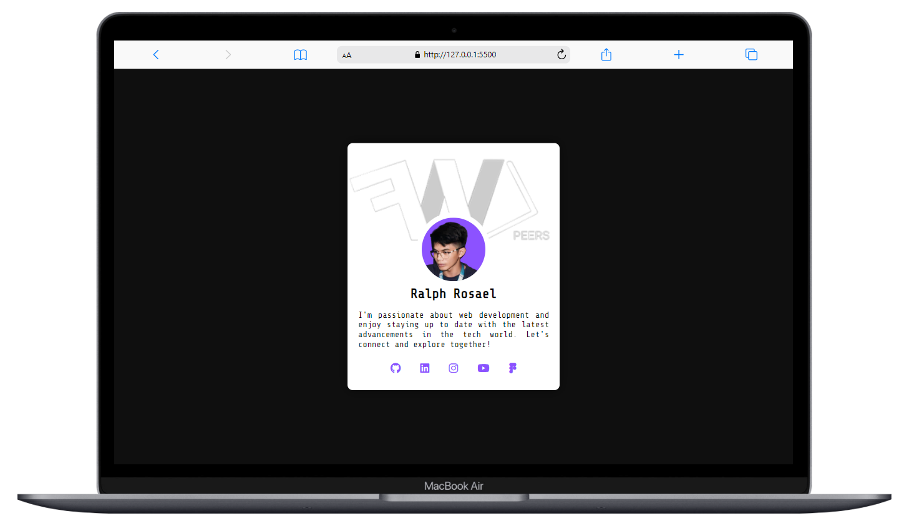

# Responsive FWDP Card

This is a simple HTML and CSS project that creates a responsive FWDP profile card for showcasing your personal information and social media links. The card is designed to adapt to various screen sizes, making it suitable for laptops, mobiles, and tablets.

## Preview

*Sample 1: A FWDP Card made during the HTML/CSS session by [Sir GengineerDev](https://github.com/GengineerDev). Also, you can follow the Filipino Web Development Peers's GitHub (https://github.com/FWDP) for more projects and resources.*

  

*Sample 2: A responsive profile card designed and developed by [Ralph](https://github.com/coder-ralph)*

## Features

- Responsive design for laptops, mobiles, and tablets.
- Customizable card content.
- Hover effect on the profile image.
- Social media icons with hover animations.

## Usage

1. Clone this repository to your local machine.

2. Open the `index.html` file in your web browser to view the profile card.

3. Customize the card content by editing the HTML and CSS as needed.

## Customization

- You can modify the card's content, including the profile image, name, and description, by editing the `index.html` file.

- To change the appearance and styles of the card, you can update the CSS in the `styles.css` file.

- You can also adjust the social media icons, links, and their appearance as per your preferences.

Feel free to use and modify this code for your personal projects.

---

## ⚙️ Tech Stack:

 